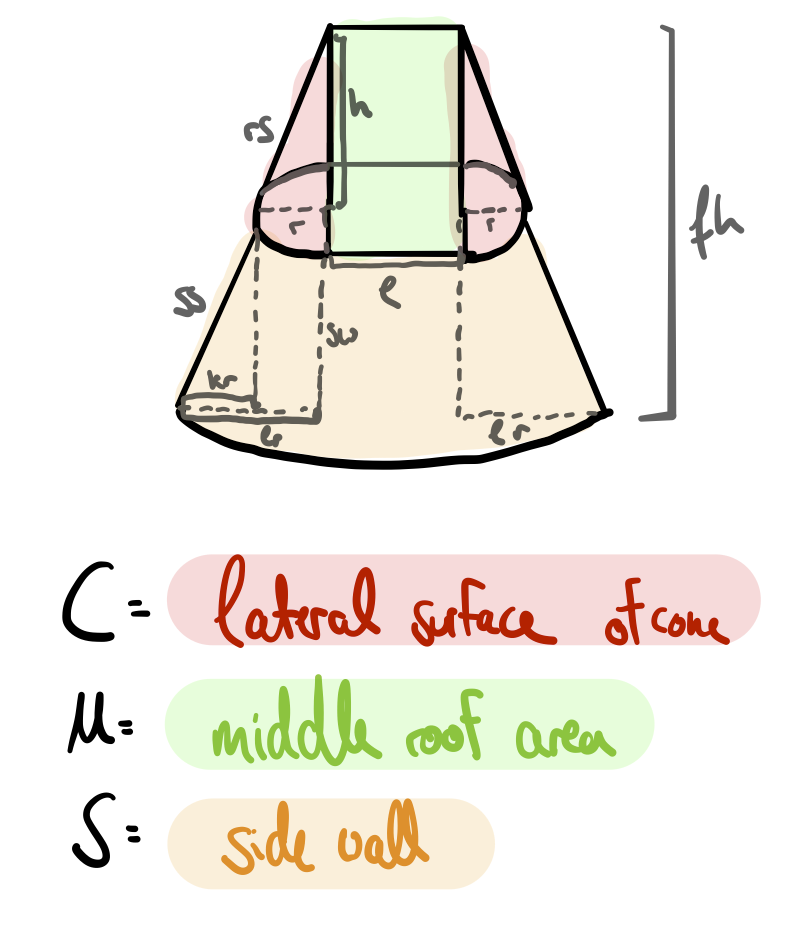
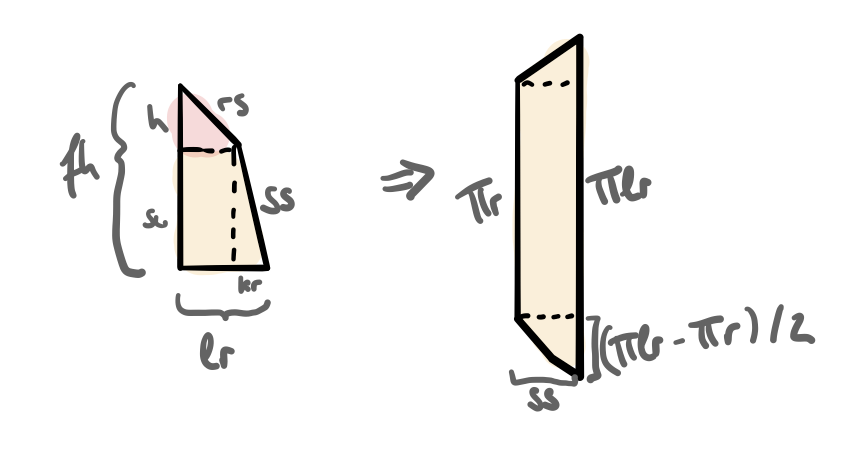
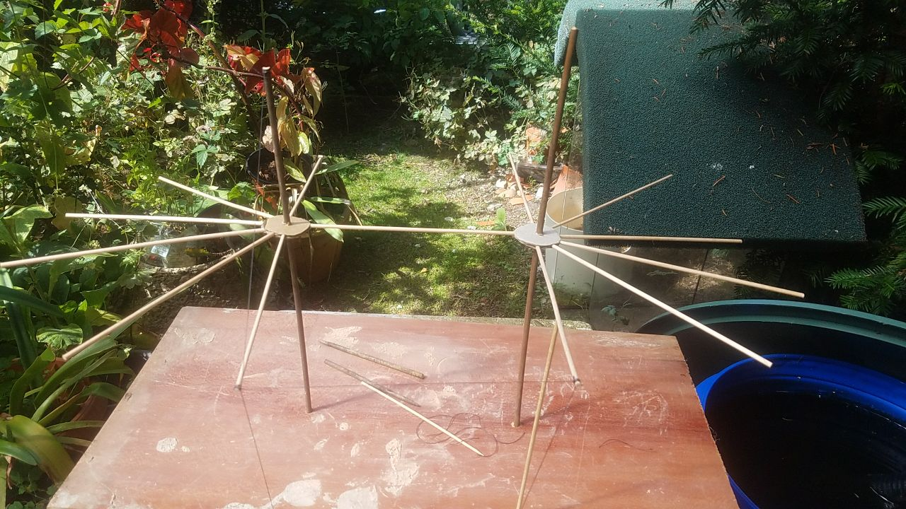

# The Fun Corner
All my fun little (data science) side projects, mostly improving my daily life.

## Annoying everyone in our tent sewing project with my own function
`tentcalculation.R` helps me calculate area of tents because we are sewing our own tents made of linen. There's different possible tent models and I'd like to calculate beforehand how much linen we'll need. The script comes with an example of a tent with a spokeswheel (imagine the spokeswheel where r is) and a tent that only has a small sidewall of 50cm (~20in) and doesn't change its radius from roof to ground. Both have the same full height fh. If you want to nerd about possible tent models, shoot me an email ;)

A potential use of this script could even be running a linear optimization to get the most volume with the smallest area, but that would be too nerdy, wouldn't it?  
Anyways, here's the full model:  

To calculate the sidewalls of the cone, I used an approach that simplifies the calculation but is very close to the real result:

And last but not least, here's an image of a spokeswheel tent prototype made out of tooth picks:  

